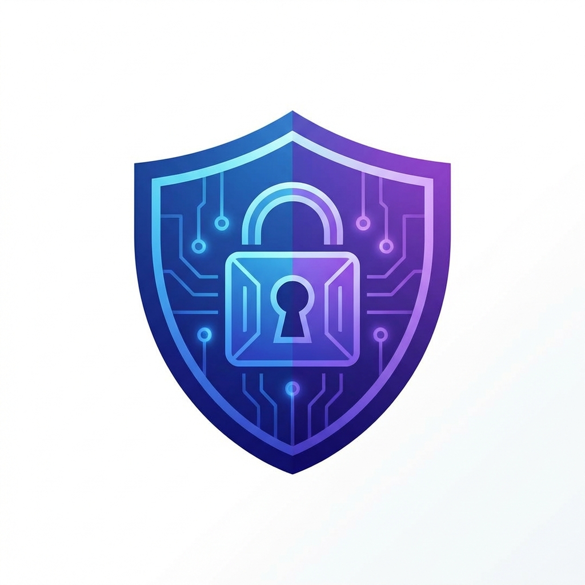

# SecurePass Generator PWA 🔒

A modern, secure, and beautiful Password Generator built with Vanilla JavaScript. Designed as a Progressive Web App (PWA) with a premium Glassmorphism aesthetic.

## Features ✨

- **🛡️ Secure Generation**: Uses the browser's `Crypto API` (`window.crypto.getRandomValues`) for cryptographically strong random numbers.
- **💎 Glassmorphism UI**: A sleek, modern interface with translucent frosted glass effects and smooth animations.
- **📱 PWA Support**: Installable on Desktop and Mobile. Works 100% offline using the `Service Worker` and `Cache API`.
- **💾 Local History**: Automatically saves your generated passwords using `IndexedDB`. History is stored locally on your device and never leaves your browser.
- **📋 Clipboard Integration**: One-click copying with visual feedback.
- **📳 Haptic & Visual Feedback**: Vibration (on supported devices) and shake animation on password generation.
- **🎛️ Customization**: Adjustable length (6-64 chars) and toggles for Uppercase, Lowercase, Numbers, and Symbols.

## Technologies Used 🛠️

- **HTML5**: Semantic structure.
- **CSS3**: Variables, Flexbox/Grid, Backyard-filter for Glassmorphism.
- **JavaScript (ES6+)**: Core logic.
- **Web APIs**:
  - `Crypto API`: For security.
  - `IndexedDB`: For data persistence.
  - `Clipboard API`: For user convenience.
  - `Cache API` & `Service Worker`: For offline capabilities.
  - `Vibration API`: For haptic feedback.

## How to Use 🚀

1. **Open the App**: Simply open `index.html` in any modern browser (Chrome, Edge, Firefox, Safari).
2. **Generate**: Select your desired options and length, then click "Generate Password".
3. **Copy**: Click the copy icon to copy the password to your clipboard.
4. **Install**:
   - **Desktop (Chrome/Edge)**: Click the Install icon in the address bar.
   - **Mobile (iOS)**: Tap "Share" -> "Add to Home Screen".
   - **Mobile (Android)**: Tap the prompt or "Install App" from the menu.

## Privacy 🔐

This application is **client-side only**.
- No external servers are used.
- Passwords are generated locally in your browser.
- History is stored in your browser's internal database (`IndexedDB`).
- No data is ever sent over the internet.

## License 📄

MIT License - feel free to use and modify!
